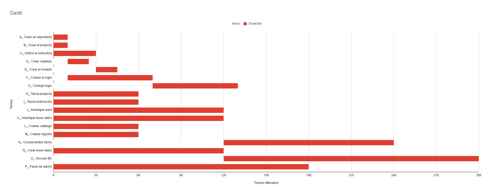
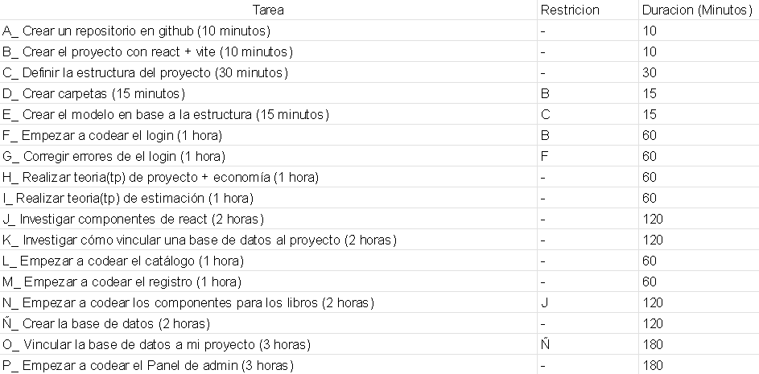
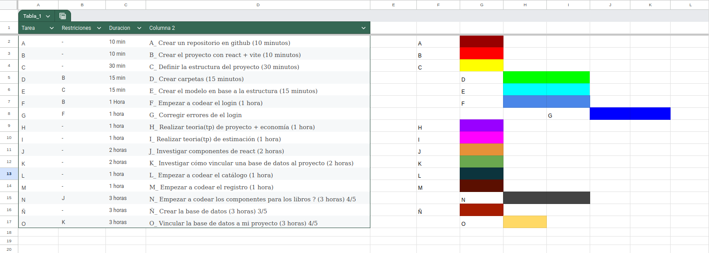

 # 📚 Bookflix

**Bookflix** es una aplicación web de biblioteca digital que permite a los usuarios registrarse, iniciar sesión, explorar un catálogo de libros clasificados por categorías y leer detalles o visualizar archivos PDF de las obras.

El proyecto está dividido en dos partes principales: un **Frontend** construido con React y Vite, y un **Backend** desarrollado con Node.js y Express conectado a una base de datos MySQL.

---

## 🚀 Tecnologías Utilizadas

### Frontend (Cliente)
- **React.js**: Biblioteca principal para la interfaz de usuario.
- **Vite**: Entorno de desarrollo rápido.
- **React Router DOM**: Para el manejo de rutas y navegación (`/`, `/catalogo`, `/book/:id`, etc.).
- **CSS3**: Estilos personalizados y diseño responsivo.
- **Framer Motion**: Para animaciones de interfaz.

### Backend (Servidor)
- **Node.js**: Entorno de ejecución.
- **Express**: Framework para manejar las rutas y peticiones HTTP.
- **MySQL2**: Cliente para conectar con la base de datos MySQL.
- **Bcrypt**: Para el hasheo y seguridad de las contraseñas.
- **Cors**: Para permitir peticiones entre el frontend y el backend.

### Base de Datos
- **MySQL**: Base de datos relacional para almacenar usuarios, libros y calificaciones.

# Gantt Mejorado
.

# Lista de tareas

# Gantt + Lista de tareas

# CPM

